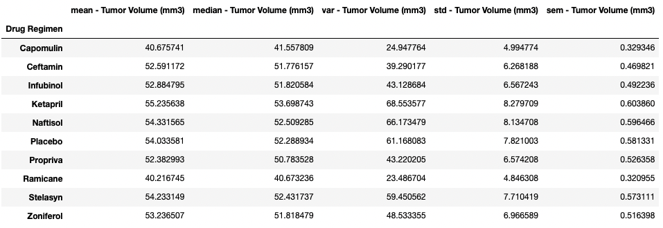
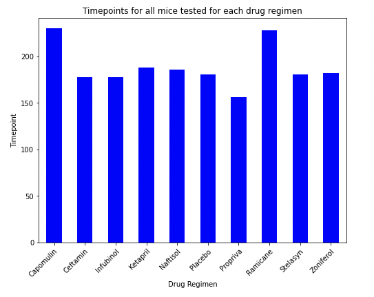
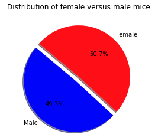
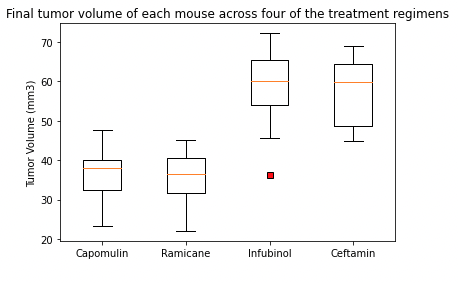
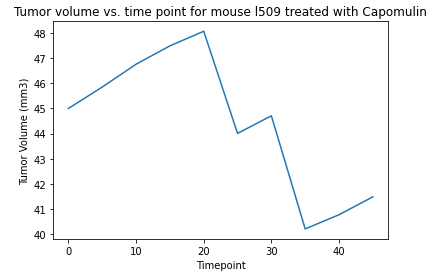
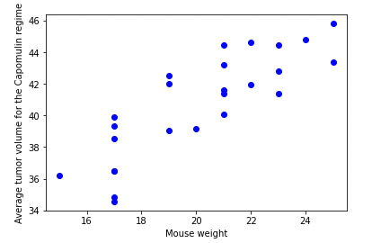
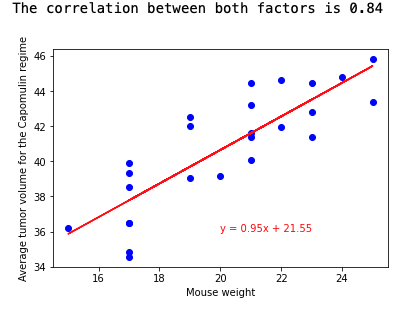

# The Power of Plots: Skin treatment regimens analysis

Author: Rosie Gianan, gianr00@gmail.com

Build With: Python, Pandas, Matplotlib, Numpy, jupyter notebook, csv files.  

## Goals:
Analyze the animal study data saved in csv files to compare the performance of a drug of interest, Capomulin versus the other treatment regimens. The file has data for 249 mice identified with SCC tumor growth were treated with a variety of drug regimens. Over the course of 45 days, tumor development was observed and measured. 

## Solutions:
Build a visualization script to compare the performance of Pharmaceuticals' drug of interest, Capomulin, versus the other treatment regimens. Create the visualization plots for the following summary reports:

-    Summary statistics for the treatment 
     

-    Total number of timepoints for all mice tested for each drug
     

-    Distribution of female vs male mice in the study
     

-    Final tumor volume for all four promising drugs
     

-    Tumor volume vs. time point for a mouse treated with Capomulin
     

-    Average tumor volume vs. mouse weight for drug Capomulin
     

-    Mouse weight vs. average tumor volume for drug Capomulin showing the correlation coefficient and linear regression
     
